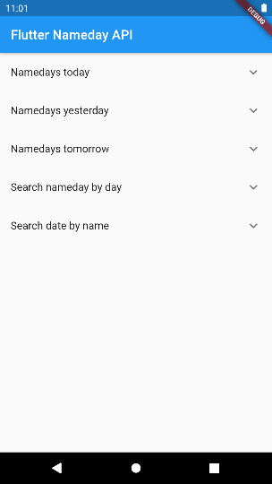

Is nameday functionality needed in your app? This package lets you implement it by speeding up getting nameday data over the internet. It is a wrapper for [Abalin.net nameday API](https://nameday.abalin.net/), so you won't have to fiddle with requests and parsing JSON. 

Abalin API is international, currently supporting namedays from 20 countries across the globe.

# Table of contents
- [Features](#features)
- [List of supported countries](#countries)
- [Usage](#usage)
- [Example](#example)
- [Credits](#credits)
- [Features, bugs and feedback](#feedback)

# <a name="features"></a>Features

1. Get namedays celebrated today, tomorrow or yesterday in 20 countries
4. Determine the date when a nameday is celebrated
5. Search nameday(s) by date

# <a name="countries"></a>Supported countries
|                    |          | Supported countries |           |                          |
|--------------------|----------|---------------------|-----------|--------------------------|
| Austria            | Bulgaria | Croatia             | Czechia   | Denmark                  |
| Estonia            | Finland  | France              | Germany   | Greece                   |
| Hungary            | Italy    | Latvia              | Lithuania | Poland                   |
| Russian Federation | Slovakia | Spain               | Sweden    | United States of America |

# <a name="usage"></a>Usage
Currently available methods are:

| Method                 | Arguments           |
|------------------------|---------------------|
| Nameday.today()        | country             |
| Nameday.tomorrow()     | country             |
| Nameday.yesterday()    | country             |
| Nameday.searchByName() | name, country       |
| Nameday.specificDay()  | country, day, month |

Learn more about usage under [examples]() or in [Dart docs]().

# <a name="example"></a>Example

All the above methods return their respective future classes, so just plug them into a FutureBuilder and you're good to go:

```dart
FutureBuilder(
  future: Nameday.today(),
  builder: (context, snapshot) {
    if (snapshot.hasData) {
      // snapshot.data is assigned to the type of class returned by the future
      // for later ease of use
      OneDayData nameDays = snapshot.data;
      return ExpansionTile(
        title: Text('Namedays today'),
        children: [
          // This fluff is where we process the data (lists) returned
          // so we get a bunch of decently pretty ExpansionTiles
          SingleChildScrollView(
            child: Column(
              children: [
                Text('Today is ${nameDays.month}/${nameDays.day}'),
                for (var element in nameDays.nameDays)
                  Text(
                    element,
                    style: _textStyle(),
                  ),
              ],
            ),
          ),
        ],
      );
    } else {
      return CircularProgressIndicator();
    }
  },
),
```

[You can see a longer example with all the methods under examples tab.]()



# <a name="credits"></a> Credits

This package is a Flutter wrapper for [Abalin.net nameday API](https://nameday.abalin.net/). Credit goes to [Vojtech Nekvapil](https://github.com/xnekv03).

# <a name="feedback"></a> Features, bugs and feedback
Did you encounter any problems while using this package? Would you like to see a feature added to it? Feel free to create an issue [here](https://github.com/hgergely03/flutter_nameday_package/issues) or send a pull request my way!